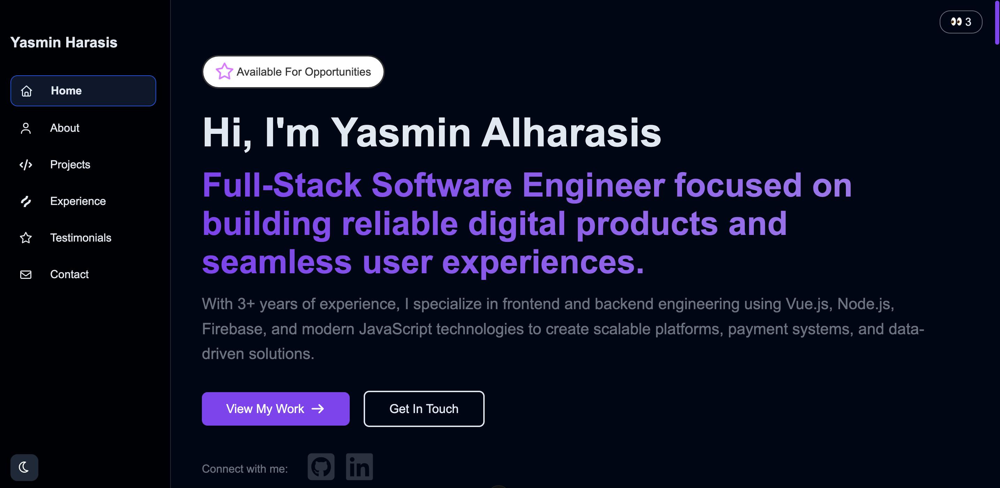

# Yasmin Al-Harasis Portfolio

A modern and responsive personal portfolio website built to showcase my projects, technical skills, and professional experience as a Software Engineer and Full-Stack Web Developer.

## 🌐 Live Demo

[https://yasmin-harasis-portfolio.netlify.app/](https://yasmin-harasis-portfolio.netlify.app/)

---

## ✨ Features

* Modern and responsive UI design
* Smooth navigation and clean layout
* Projects showcase section
* Skills and technologies section
* About and experience section
* Contact form integration using EmailJS
* Testimonials section for showcasing client/user feedback
* Firebase database integration for dynamic data management
* Optimized for desktop, tablet, and mobile devices
* Reusable and structured component-based architecture

---

## 🛠️ Built With

* Vue.js
* Vite
* SCSS
* Firebase
* EmailJS
* JavaScript (ES6+)

---

## 🎯 Purpose

This portfolio was built to present my professional experience, technical skills, and frontend/full-stack projects in a modern and user-friendly way while practicing clean architecture, responsive design, and performance-focused development.

---

## 📸 Preview



---

## 🚀 Getting Started

Clone the repository:

```bash
git clone https://github.com/yasmin-alharasis/yasmin-portfolio.git
```

Install dependencies:

```bash
npm install
```

Run the development server:

```bash
npm run dev
```

Build for production:

```bash
npm run build
```

---

## 👩‍💻 Author

Yasmin Al-Harasis

* Portfolio: [https://yasmin-harasis-portfolio.netlify.app/](https://yasmin-harasis-portfolio.netlify.app/)
* GitHub: [https://github.com/yasmin-alharasis](https://github.com/yasmin-alharasis)
* LinkedIn: [https://linkedin.com/in/yasmin-al-harasis](https://linkedin.com/in/yasmin-al-harasis)
